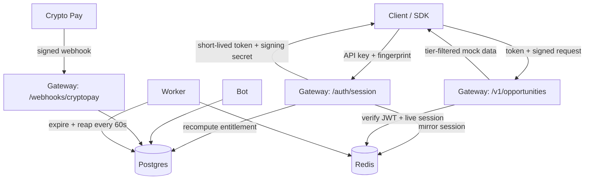

# Architecture

_Source: `README.md`, `docker-compose.yml`, `app/` layout_

Three processes share one codebase (`app/core`, `app/models`, `app/services`) so
licensing logic lives in exactly one place.

| Service    | Role |
|------------|------|
| `gateway`  | FastAPI — [[API Reference\|/auth/session]], protected engine, payment webhook |
| `bot`      | aiogram 3.x — client + admin commerce ([[Bot Commands]]) |
| `worker`   | APScheduler — subscription expiry + session reaping ([[Worker and Expiry]]) |
| `postgres` | system of record ([[Data Model]]) |
| `redis`    | live [[Session Token\|sessions]], rate-limit buckets, IP velocity, [[Entitlement]] cache |

## Request / data flow

See [[Licensing Model]] for the enforcement pipeline and [[Zero-Trust Principles]]
for why nothing is trusted from the client.
