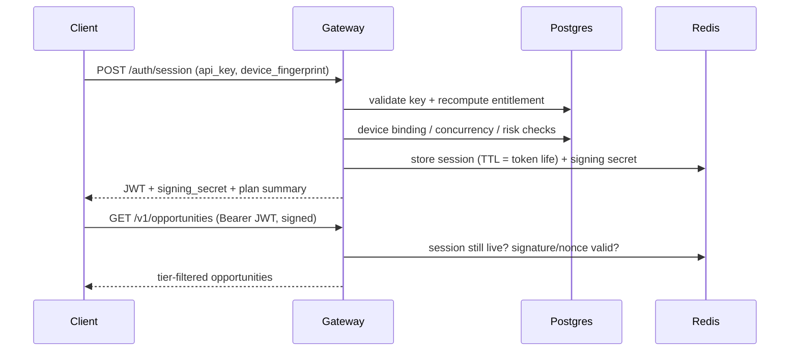

# Licensing Model

_Source: `app/services/licensing.py`, `app/core/security.py`, `app/gateway/deps.py`_

The backbone: an [[API Key]] is **never** used directly against the engine.
It is exchanged for a short-lived, device-bound [[Session Token]] at
`POST /auth/session`. Protected endpoints accept only the token. This creates one
chokepoint where all sharing/abuse is detected ([[Anti-Abuse]]).

## Enforcement pipeline (`/auth/session`)

All steps are server-side ([[Zero-Trust Principles]]):

1. **Key** — hash + look up; must be active (not disabled). → [[API Key]]
2. **[[Entitlement]]** — recompute from Postgres; subscription active & unexpired.
3. **[[Device Fingerprint]]** — known+active, or within `max_devices`, else 24h cooldown.
4. **Concurrency** — within `max_concurrent_sessions`, else evict oldest + log.
5. **Multi-account** — same fingerprint under other accounts → flag cluster.
6. **Risk** — [[Impossible Travel]] / IP velocity → flag if tripped.
7. **Issue** — device-bound JWT + per-session signing secret, mirrored in Redis.

Tokens refresh through the same check, so revocation propagates within minutes.
See [[API Reference]] for the wire format and [[Nonce]] for anti-replay.
